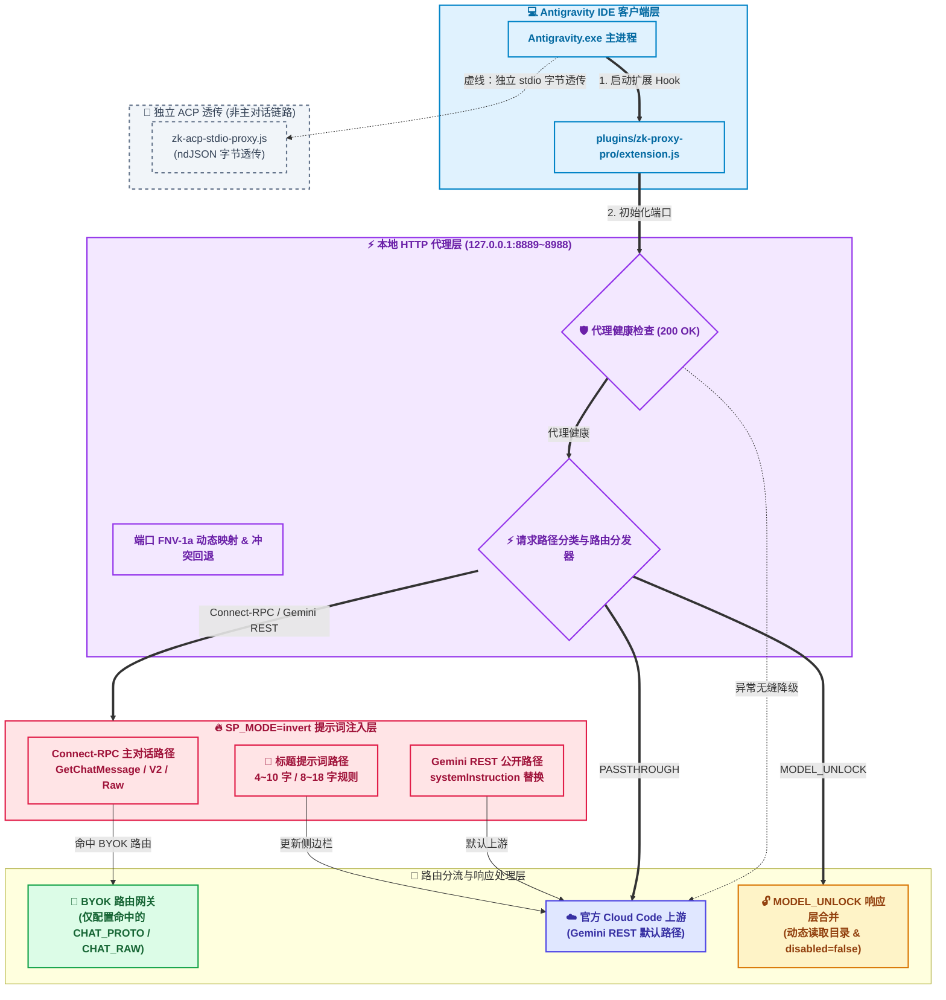
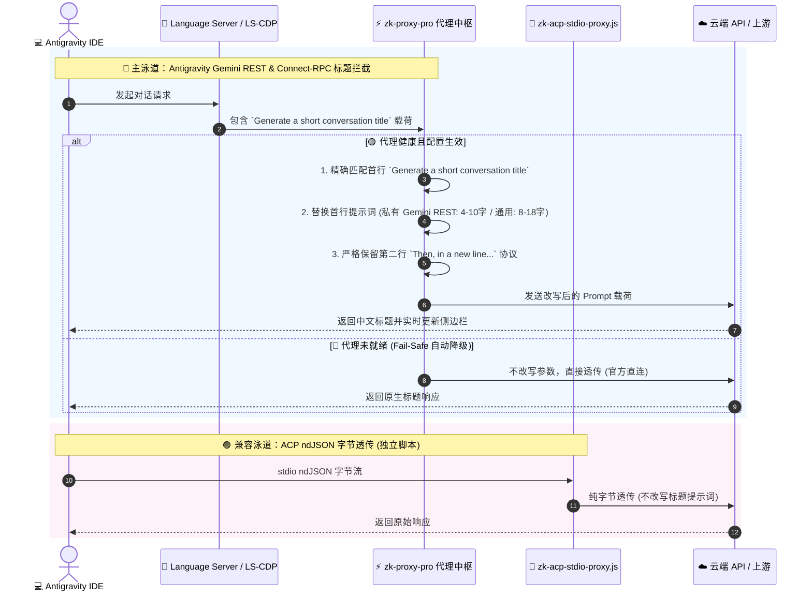
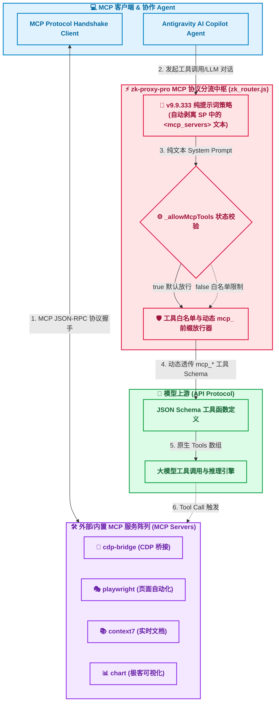

# Antigravity-Injection · 反重力 IDE 提示词注入与增强套件

这是一个面向 **Antigravity IDE**（已适配 1.20.6 等版本）及生态的系统提示词注入与语言服务器中文化增强插件套件。

通过拦截本地 HTTP 代理与语言服务器请求，无需修改 IDE 二进制即可接管符合分类规则的全局系统提示词 (System Prompt)，并支持自动将 AI 对话标题转换为简体中文。

---

## 💡 核心功能

1. **反重力 IDE 系统提示词注入 (System Prompt Inversion)**
   - **机制原理**：通过在本地代理层（`sp_invert.js` / `source.js`）实时拦截与重写客户端发起的推理请求（gRPC/HTTP），接管官方硬编码的全局系统提示词 (System Prompt)。
   - **功能特性**：支持自定义系统提示词，并按请求类型区分主对话、摘要、记忆与标题请求，避免误改无关载荷。

2. **语言服务器 (LSP / ACP) 中文标题提示词注入 (Chinese Title Prompt Injection)**
   - **机制原理**：Antigravity 主链路通过 LS/CDP 与 HTTP 代理拦截语言服务器请求；仓库另含 ACP `devin.exe` stdio 字节透传脚本，但当前 Antigravity 主激活路径不启用 ACP 模式。
   - **功能特性**：按请求路径改写标题提示词：Antigravity 私有 Gemini REST 路径要求首行 **4~10 个汉字**；通用 `TITLE_ONLY_ZH_SP` 规则要求 **8~18 个汉字**，并保留后续格式协议行。

3. **适配 Antigravity 1.20.6**
   - 自动识别 Windows 平台的 `Antigravity.exe` 主程序及兼容运行时路径。
   - 保留 `settings.json` 的 JSONC 注释格式，自动注入反代端口及语言服务器端点参数。
   - 内置 Fail-Safe 机制：若代理未就绪则自动无缝降级为官方直连，不影响 IDE 原生功能。

---

## 🎨 架构图表与工程事实矩阵

### 1. 双链路事实架构图 (Clear & High-Contrast Architecture)


---

### 2. 语言服务器标题改写与 Fail-Safe 细节泳道图 (Swimlane Protocol)


---

### 3. .mcp 高阶协议工具路由流转图 (MCP Tool Protocol & Pure Prompt Pipeline)




---

### 4. 核心能力事实矩阵 (Engineering Capability Matrix)


| 核心能力 | 代码入口 | 生效条件 | 证据边界 |
| :--- | :--- | :--- | :--- |
| **`🟢 [已实现]` System Prompt 替换** | `plugins/zk-proxy-pro/vendor/外接api/core/sp_invert.js` | `SP_MODE=invert` && (Connect-RPC/Gemini REST 主对话) | 仅在主对话路径替换 systemInstruction / prompt 锚点 |
| **`🟡 [条件生效]` 标题提示词替换** | `plugins/zk-proxy-pro/vendor/外接api/core/sp_invert.js` | 检测到 `Generate a short conversation title` 请求 | 只替换首行规范，保留第二行协议，模型字数靠提示词约束 |
| **`🟡 [条件生效]` LS 参数改写** | `plugins/zk-proxy-pro/extension.js` | 本地 HTTP 代理健康检查 200 OK | 代理异常时清除锚点回归官方直连 (Fail-Safe) |
| **`🟡 [条件生效]` BYOK 路由** | `plugins/zk-proxy-pro/vendor/外接api/runtime.js` | 配置匹配 `CHAT_PROTO` / `CHAT_RAW` 路由 | 仅覆盖配置命中的 Connect-RPC，Gemini REST 走官方 Cloud Code |
| **`🟢 [已实现]` 模型目录响应合并** | `plugins/zk-proxy-pro/vendor/外接api/runtime.js` | 响应层匹配模型目录接口 | 只解锁前端目录可见性与 `disabled=false`，不等于上游实际调用权限 |
| **`🟢 [已实现]` JSONC 注释保留** | `plugins/zk-proxy-pro/vendor/外接api/core/sp_invert.js` | 解析 `settings.json` / JSONC 格式配置 | 基于正则剥离与 JSON 解析，保留配置文件中的注释说明 |
| **`🔵 [仅透传]` Fail-Safe 官方直连** | `plugins/zk-proxy-pro/extension.js` | 代理服务断开或未在端口响应 | 进程 Hook 不改写参数，自动降级为官方直接传输 |

---

## 🔗 推荐🌟🌟🌟🌟🌟⭐反重力 IDE 生态配套工具

| 配套工具 / 资源 | GitHub 链接 | 功能说明 |
| --- | --- | --- |
| 🏛 **Antigravity 历史版本库** | [Antigravity-ide-history](https://github.com/Huo-zai-feng-lang-li/Antigravity-ide-history) | 收集 Antigravity IDE 历史版本（如 `Antigravity-1.20.6.exe`），方便版本回退与特定环境测试。 |
| ⚡ **Antigravity-Power-Pro** | [Antigravity-Power-Pro](https://github.com/Huo-zai-feng-lang-li/Antigravity-Power-Pro) | 支持自定义提示词增强、一键快速滚动、侧边栏自由调整大小等。 |
| 🤖 **Auto-Agent-AntiGravity** | [Auto-Agent-AntiGravity](https://github.com/Huo-zai-feng-lang-li/Auto-Agent-AntiGravity) | Agent 自动点击工具：支持自动点击接受（Auto-Accept）、自动点击重试（Auto-Retry），实现全自动协同。 |
| 🔌 **vscode-antigravity-cockpit** | [vscode-antigravity-cockpit](https://github.com/Huo-zai-feng-lang-li/vscode-antigravity-cockpit) | 插件版切号：配合桌面端实现无感换号。 |
| 🧰 **cockpit-tools** | [cockpit-tools](https://github.com/Huo-zai-feng-lang-li/cockpit-tools) | 桌面端切号工具：无感切号桌面端配套组件。 |

---

## 📦 最新核心插件

> 下表由 `tools/gen-readme-index.js` 据 `package.json` 版本自动维护。

<!-- ZK-MODULE-INDEX:START -->
| 插件 | 版本 | 扩展 id | 说明 | Release / 下载 |
|---|---|---|---|---|
| **zk-proxy-pro** | `9.9.500` | `zk-agi.zk-proxy-pro` | Antigravity 提示词反代 + 外接 API：自定义提示词、渠道、路由、用量。 | [Release](https://github.com/Huo-zai-feng-lang-li/Antigravity-Injection/releases/tag/zk-proxy-pro-v9.9.500) · [⬇ VSIX](https://github.com/Huo-zai-feng-lang-li/Antigravity-Injection/releases/download/zk-proxy-pro-v9.9.500/zk-proxy-pro-9.9.500.vsix) |
<!-- ZK-MODULE-INDEX:END -->

---

## 🛠 代码架构与关键路径

### 1. 架构说明
插件使用独立命名空间 `zk.*/wam.*` 与 per-user 端口（默认按用户名映射到 `8889~8988`，可显式配置，冲突时回退空闲端口），提供底层代理、外接 API、模型路由及语言服务器注入功能。外接 API 路由当前仅覆盖配置命中的 Connect-RPC 聊天路径；Gemini REST 路径仍走官方 Cloud Code 上游。模型目录解锁属于响应层可见性合并，不等于上游权限或每个模型均可调用。

### 2. 关键代码文件
- `plugins/zk-proxy-pro/extension.js`: 扩展入口，负责 IDE 进程感知与配置 Hook。
- `plugins/zk-proxy-pro/zk-acp-stdio-proxy.js`: ACP (stdio) 代理拦截服务。
- `plugins/zk-proxy-pro/vendor/外接api/core/sp_invert.js`: 提示词判定与中文标题规范 (`TITLE_ONLY_ZH_SP`) 注入。
- `tools/checks/antigravity-target-check.js`: Antigravity 自动化目标断言测试集。

---

## 🚀 使用与构建

### 1. 安装插件
1. 在 IDE 中按下 `Ctrl+Shift+P`。
2. 选择 `Extensions: Install from VSIX...` 并选择打包好的 `.vsix` 文件。

如需使用 CDP 调试能力，请以实际主程序路径启动：
```cmd
Antigravity.exe --remote-debugging-port=9000
```

### 2. 打包与自检 (Node.js ≥ 20)
```bash
# 构建插件 package
node scripts/build-vsix.mjs zk-proxy-pro

# 运行自动化目标离线断言测试
node tools/checks/antigravity-target-check.js
```
